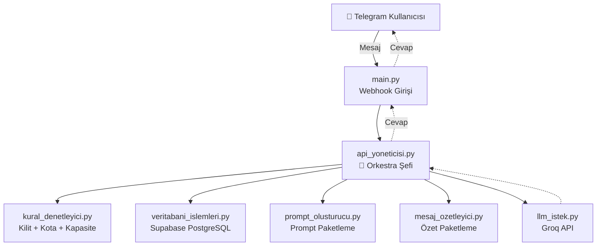

# 🤖 Sanal Arkadaş Bot

Telegram üzerinden çalışan, kısa ve uzun süreli hafızaya sahip, kullanıcı bazlı hız/kota
kontrolü yapan, yapay zeka destekli bir sohbet botu. FastAPI + SQLAlchemy + Groq API
üzerine kurulu, katmanlı ve tek-sorumluluk prensibine (SOLID) uygun bir mimariyle
yazılmıştır.

---

---

## 🔗 Botu Hemen Dene

Kurulum falan gerekmiyor — tek yapman gereken Telegram'da botu açıp mesaj atmak:

👉 **[@Sanal_Arkadasim_bot](https://t.me/Sanal_Arkadasim_bot)**

Bot normal şekilde cevap veriyorsa işin bu kadar, sohbete devam edebilirsin. Eğer bot
sana **"Kapasitemiz doldu!"** diye cevap verirse (yani sınırlı kullanıcı kotamız
dolduysa), aşağıdaki [Kapasite Sınırına Takıldın mı?](#-kapasite-sınırına-takıldın-mı)
bölümündeki adımlarla birkaç dakikada kendi botunu ayağa kaldırabilirsin.

---

## ✨ Özellikler

- **Doğal sohbet** — Groq API üzerinden çalışan bir LLM ile samimi, günlük dilde cevaplar.
- **Kısa süreli hafıza** — Son mesajlar veritabanından çekilip her isteğe dahil edilir.
- **Uzun süreli hafıza (otomatik özetleme)** — Mesaj sayısı bir eşiği aştığında geçmiş
  konuşma otomatik olarak özetlenir, veritabanına yazılır ve kısa bellek temizlenir.
- **`/reset` komutu** — Kullanıcı, hem kısa hem uzun belleğini tek komutla sıfırlayabilir.
- **Günlük mesaj kotası** — Kullanıcı başına günlük limit, veritabanında kalıcı olarak
  tutulur (sunucu yeniden başlasa bile sıfırlanmaz).
- **Eşzamanlı istek kilidi** — Bir kullanıcının art arda/spam mesaj atması, önceki isteği
  bitmeden ikinci bir isteğin işlenmesini engeller.
- **Kapasite sınırı** — Sistem, belirlenen sayıda kullanıcıyla sınırlıdır; sınır dolduğunda
  yeni kullanıcılar bilgilendirilir (bkz. [Kapasite Sınırına Takıldın mı?](#-kapasite-sınırına-takıldın-mı)).
- **Sağlam hata yönetimi** — Veritabanı, LLM API veya beklenmedik bir hata durumunda
  kullanıcı asla kilitli kalmaz, her zaman anlamlı bir mesaj alır.
- **Webhook güvenliği** — Telegram'ın `secret_token` mekanizmasıyla, webhook endpoint'ine
  sadece gerçek Telegram isteklerinin ulaşması garanti edilir.

---

## 🏗️ Mimari

Sistem, **"Orkestra Şefi"** deseniyle tasarlanmıştır: hiçbir modül bir diğeriyle doğrudan
konuşmaz, hepsi tek bir merkezden (`api_yoneticisi.py`) yönetilir.



| Katman | Dosya | Sorumluluğu |
|---|---|---|
| Giriş noktası | `main.py` | Telegram webhook'unu karşılar, kimlik doğrular |
| Orkestrasyon | `src/controller/api_yoneticisi.py` | Tüm akışı yönetir, diğer modülleri sırayla çağırır |
| Kurallar | `src/middleware/kural_denetleyici.py` | Kapasite, günlük kota, spam kilidi |
| Veritabanı | `src/database/veritabani_islemleri.py`, `models.py` | Tüm DB okuma/yazma işlemleri |
| Prompt | `src/services/prompt_olusturucu.py` | LLM'e gidecek mesaj paketini kurar |
| Özetleme | `src/services/mesaj_ozetleyici.py` | Özetleme için LLM paketini hazırlar (LLM'e kendi gitmez) |
| LLM iletişimi | `src/services/llm_istek.py` | Groq API ile tek temas noktası |
| Loglama | `logger.py` | Hem dosyaya hem stdout'a (Render log ekranı için) yazar |

---

## 🛠️ Teknoloji Yığını

- **Framework:** FastAPI + Uvicorn
- **ORM / Veritabanı:** SQLAlchemy + PostgreSQL (Supabase)
- **Yapay Zeka:** Groq API (OpenAI uyumlu `chat/completions` uç noktası)
- **Barındırma:** Render (GitHub'a push edildiğinde otomatik deploy)
- **CI/CD:** GitHub Actions + Pytest
- **Mesajlaşma:** Telegram Bot API (webhook tabanlı)

---

## 🚀 Kurulum

### 1. Depoyu klonla

```bash
git clone https://github.com/<kullanici-adin>/<repo-adin>.git
cd <repo-adin>
pip install -r requirements.txt
```

### 2. Telegram botu oluştur

1. Telegram'da **@BotFather**'a git, `/newbot` ile yeni bir bot oluştur.
2. Sana verilen **API Token**'ı not al — bunu kimseyle paylaşma.

### 3. Groq API anahtarı al

[console.groq.com](https://console.groq.com) üzerinden ücretsiz bir hesap açıp bir API
anahtarı oluştur.

> **Model seçimi hakkında not:** Groq, "agentic/sistem" tipi modeller de sunuyor
> (ör. `groq/compound`). Bu tip modeller araç kullanımı ve çok adımlı akıl yürütme için
> tasarlanmıştır; casual bir sohbet botu için kendi iç akıl yürütme sürecini cevaba
> sızdırabilir ve gereksiz yere hızlı rate-limit'e takılabilir. Bunun yerine standart,
> düz bir sohbet modeli (`openai/gpt-oss-20b` gibi) kullanman önerilir. Hesabında hangi
> modellerin açık olduğunu görmek için:
> ```bash
> curl https://api.groq.com/openai/v1/models -H "Authorization: Bearer <API_ANAHTARIN>"
> ```

### 4. Supabase veritabanı kur

1. [supabase.com](https://supabase.com) üzerinden ücretsiz bir proje oluştur.
2. **Project Settings → Database** altından bağlantı dizesini (`DATABASE_URL`) al.
3. Uygulama ilk çalıştığında tabloları kendisi oluşturur (`Base.metadata.create_all`).
   Ancak şema değişikliklerinde (yeni sütun eklendiğinde) bunu **otomatik yapmaz** —
   gerekirse Supabase'in **SQL Editor**'ünden elle `ALTER TABLE` çalıştırman gerekir.

### 5. Ortam değişkenlerini ayarla

Proje kökünde bir `.env` dosyası oluştur (bkz. [Ortam Değişkenleri](#-ortam-değişkenleri)).

### 6. Render'a deploy et

1. [render.com](https://render.com) üzerinde yeni bir **Web Service** oluştur, GitHub
   deponu bağla.
2. **Environment** sekmesinden `.env`'deki tüm değişkenleri **ayrıca** Render'a da gir —
   `.env` dosyası sadece local'de okunur, Render'a otomatik taşınmaz.
3. Start komutu: `uvicorn main:app --host 0.0.0.0 --port $PORT`

### 7. Webhook'u kaydet

Render'daki servis URL'in elindeyken, Telegram'a webhook'unu bildir:

```bash
curl -F "url=https://<render-servisin>.onrender.com/webhook" \
     -F "secret_token=<TELEGRAM_WEBHOOK_SECRET_DEĞERİN>" \
     "https://api.telegram.org/bot<TELEGRAM_BOT_TOKEN>/setWebhook"
```

Doğrulamak için:
```bash
curl "https://api.telegram.org/bot<TELEGRAM_BOT_TOKEN>/getWebhookInfo"
```
`"last_error_message"` alanının boş olması gerekir.

---

## ⚙️ Ortam Değişkenleri

| Değişken | Açıklama |
|---|---|
| `TELEGRAM_BOT_TOKEN` | BotFather'dan alınan bot token'ı |
| `TELEGRAM_WEBHOOK_SECRET` | Webhook isteklerini doğrulamak için rastgele, gizli bir metin |
| `LLM_API_URL` | Groq'un `chat/completions` uç noktası |
| `LLM_API_KEY` | Groq API anahtarı |
| `LLM_MODEL_NAME` | Kullanılacak model kimliği (ör. `openai/gpt-oss-20b`) |
| `DATABASE_URL` | Supabase PostgreSQL bağlantı dizesi |

---

## 💬 Kullanım

Bota Telegram'dan normal şekilde mesaj at, sohbet başlasın. Hafızanı tamamen sıfırlamak
istersen:

```
/reset
```

---

## 🧪 Testler

```bash
pip install pytest
PYTHONPATH="." pytest tests/ -v
```

CI, her `main`/`master` push'unda ve pull request'te GitHub Actions üzerinden otomatik
çalışır (bkz. `.github/workflows/ci-cd.yml`).

---

## 🔒 Kapasite Sınırına Takıldın mı?

[Yukarıdaki linkten](#-botu-hemen-dene) bota mesaj attığında **"Kapasitemiz doldu!"**
cevabını aldıysan, bu senin için yazıldı. Bu bot, sunucu maliyetlerini kontrol altında
tutmak için **sınırlı sayıda kullanıcıyla** çalışacak şekilde ayarlanmıştır
(`src/middleware/kural_denetleyici.py` içindeki `MAKSIMUM_KULLANICI_KAPASITESI`
sabiti). Botun döndüğü mesaj da seni zaten bu depoya yönlendiriyor.

**Eğer bu mesajı aldıysan, kendi ücretsiz botunu birkaç adımda ayağa kaldırabilirsin:**

1. Bu depoyu **fork**'la veya klonla.
2. Yukarıdaki [Kurulum](#-kurulum) bölümündeki adımları takip et — kendi Telegram
   botunu, kendi Groq anahtarını ve kendi Supabase veritabanını oluştur.
3. `.env`'ini doldur, Render'a (veya tercih ettiğin başka bir platforma) deploy et.
4. Webhook'unu kaydet, botun tamamen senin kontrolünde, sınırsız ve ücretsiz çalışsın.

Takıldığın bir adım olursa, depodaki kodun kendisi (özellikle `src/` altındaki her
dosyanın başındaki yorumlar) süreci adım adım anlatacak şekilde yazılmıştır.

---

## 📁 Proje Yapısı

```
.
├── main.py                          # Webhook giriş noktası
├── logger.py                        # Loglama (dosya + stdout)
├── requirements.txt
├── .github/workflows/ci-cd.yml      # CI/CD pipeline
├── tests/
│   ├── test_bagimliliklar.py        # Bağımlılık/ortam testleri
│   ├── test_birim_kurallar.py       # Kural denetleyici + prompt testleri
│   └── test_entegrasyon_db.py       # Veritabanı entegrasyon testleri
└── src/
    ├── controller/
    │   └── api_yoneticisi.py        # Orkestra Şefi
    ├── database/
    │   ├── models.py                # SQLAlchemy modelleri
    │   └── veritabani_islemleri.py  # DB okuma/yazma fonksiyonları
    ├── middleware/
    │   └── kural_denetleyici.py     # Kapasite, kota, kilit kuralları
    └── services/
        ├── prompt_olusturucu.py     # LLM prompt paketleme
        ├── mesaj_ozetleyici.py      # Özetleme paketleme
        └── llm_istek.py             # Groq API istemcisi
```

---

## 🤝 Katkıda Bulunma

Pull request'ler ve issue'lar memnuniyetle karşılanır. Değişiklik göndermeden önce
lütfen `pytest tests/ -v` ile test paketinin geçtiğinden emin ol.